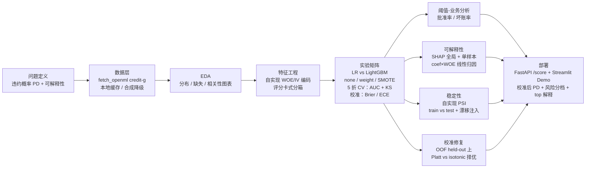

# credit-risk-modeling

端到端信贷违约风险建模：**问题 → 数据 → 实验 → 解释 → 部署** 的科研式完整链路。

以公开的 [OpenML credit-g（Statlog German Credit）](https://www.openml.org/d/31) 数据集为载体，
回答一个业务问题：**给定申请人的 20 维画像，预测其违约概率（PD），并给出可审计的解释**。
包含自实现的 WOE/IV 编码、KS/PSI/Brier/ECE 指标、2 模型 × 3 不平衡策略实验矩阵、
SHAP 可解释性与 FastAPI 评分服务。


---

## 架构



## 快速开始

```bash
# 1. 安装依赖（系统 Python ≥ 3.10）
pip install -r requirements.txt

# 2. 复现实验（拉取数据 → 全部实验 → 产物与报告；已提交的结果可跳过）
python scripts/run_eda.py
python scripts/run_training.py

# 3. 全量测试（109 个）
python -m pytest tests

# 4. 启动评分服务
uvicorn app.main:app --port 8000

# 5. 评分示例
curl -X POST http://127.0.0.1:8000/score -H "Content-Type: application/json" -d '{
  "checking_status": "<0", "duration": 48, "credit_history": "delayed previously",
  "purpose": "new car", "credit_amount": 12000, "savings_status": "<100",
  "employment": "unemployed", "installment_commitment": 4,
  "personal_status": "male single", "other_parties": "none",
  "residence_since": 1, "property_magnitude": "no known property",
  "age": 22, "other_payment_plans": "bank", "housing": "rent",
  "existing_credits": 4, "job": "unskilled resident", "num_dependents": 2,
  "own_telephone": "none", "foreign_worker": "yes"
}'
```

## Model Card

### 模型与训练数据

| 项 | 值 |
|---|---|
| 训练数据 | OpenML credit-g v1，1000 行 × 20 特征，公开学术数据 |
| 目标定义 | `class: bad→1（违约）`，正类 = 违约；坏样本率 30.0% |
| 切分 | 分层 train/test = 800/200（seed=42），CV 为 5 折分层 |
| 特征处理 | 自实现 WOE 分位数分箱编码（加法平滑 α=0.5，缺失/未见值映射中性 0） |
| 部署模型 | **LogisticRegression + class_weight="balanced" + sigmoid 校准**（版本 1.0.0） |
| 训练环境 | Python 3.10.9 / scikit-learn 1.7.2 / LightGBM 4.6.0 / SHAP 0.49.1 |

### 真实评估指标（scripts/run_training.py 实跑产出，见 artifacts/metrics.json）

**部署模型（logistic_regression + weight）独立测试集（n=200）：**

| AUC | KS | Gini |
|---|---|---|
| **0.8013** | **0.5119** | **0.6026** |

CV AUC = 0.7836 ± 0.0475，CV KS = 0.4935 ± 0.0642。

**2 模型 × 3 不平衡策略实验矩阵**（按 CV AUC 排序，完整数据见 [reports/model_comparison.csv](reports/model_comparison.csv)）：

| model | strategy | CV AUC | CV KS | test AUC | test KS |
|---|---|---|---|---|---|
| logistic_regression | weight | 0.7836 | 0.4935 | **0.8013** | 0.5119 |
| logistic_regression | smote | 0.7824 | 0.4976 | 0.8004 | 0.5143 |
| logistic_regression | none | 0.7823 | 0.4994 | 0.8004 | 0.5238 |
| lightgbm | none | 0.7468 | 0.4196 | 0.7711 | 0.4286 |
| lightgbm | weight | 0.7462 | 0.4065 | 0.7775 | 0.4738 |
| lightgbm | smote | 0.7453 | 0.4119 | 0.7617 | 0.4452 |

**类不平衡结论**：credit-g 坏样本率约 30%，不平衡程度温和。同一模型下 weight 与 SMOTE 的
CV AUC 差距仅 0.0012（LR）/ 0.0009（LightGBM），SMOTE 未带来可辨识收益；
样本加权以更低复杂度、更小的线上副作用（无需重采样）达到同等效果，故部署默认 weight。
若业务场景坏样本率 <5%，该结论需要重新实验。

### 可解释性

- **全局重要性**：SHAP（TreeExplainer，LightGBM+weight 上计算）mean(|SHAP|)。
  Top 3：`checking_status`、`duration`、`purpose`（完整表见 [reports/shap_global_importance.csv](reports/shap_global_importance.csv)）。
  本环境 SHAP 可用，**未触发降级**；若环境缺失 shap，代码自动降级为 permutation importance 并在产物中如实标记方法名。
- **单样本解释**：部署模型为逻辑回归，采用 `coef_i × (x_woe_i − mean_woe_i)` 归因
  （方法名 `coef_x_woe_deviation`）；LightGBM 路径走 Tree SHAP。两口径在训练报告中并排对照。
- **WOE/IV**：`checking_status` IV=0.609（>0.5 标记 suspicious，提示潜在信息泄漏式强变量，评分卡实务中需人工复核）、
  `duration` IV=0.293、`credit_history` IV=0.262（完整表见 [reports/iv_table.csv](reports/iv_table.csv)）。

### 稳定性（自实现 PSI）

- train vs test：20 特征最大 PSI **0.0727** → 全部 <0.1，同分布切分符合预期；
- 漂移注入对照（age+15 / credit_amount×1.5 / duration+12）：age PSI 升至 **4.24**、
  duration 升至 **3.14**、credit_amount 升至 **0.50**，验证 PSI 实现确实能检出漂移
  （见 [reports/stability_report.md](reports/stability_report.md)）。

### 概率校准（发现 → 修复 → 复测）

排序指标（AUC/KS）不约束 PD 的绝对值；AUC=0.80 不代表"预测 PD=0.6 的群组真有 60% 违约率"。
等频 10 桶可靠性分析（独立测试集 n=200，scripts/run_training.py 实跑产出）：

**① 发现（修复前的量化记录，保留原始数字）**

| 模型 | Brier ↓ | ECE ↓ | 平均预测 PD | 实际违约率 |
|---|---|---|---|---|
| 部署：LR + weight（校准前） | 0.1810 | 0.1420 | 0.437 | 0.300 |
| 参照：LR + none（不加权） | 0.1574 | 0.0505 | 0.301 | 0.300 |

`class_weight="balanced"` 在排序能力几乎不变的前提下（test AUC 0.8013 vs 0.8004），
把预测 PD 的绝对值系统性抬高约 **+0.137**（ECE 0.142 vs 参照 0.051）——
校准前的 PD 不能直接当作真实违约概率用于定价或资本计算。

**② 修复（OOF held-out 校准，sigmoid vs isotonic 择优）**

`src/creditrisk/calibration_repair.py`：训练集 5 折分层 CV 产出每条样本的 held-out
（out-of-fold）预测概率 → OOF 分层切两半，在 sel_fit（n=400）上分别拟合
Platt scaling（sigmoid）与 isotonic，在 sel_val（n=400）上对比 ECE 择优；
择优者用全部 OOF（n=800）重拟合为部署校准器。测试集只做单调变换，**绝不参与校准器拟合**。

| 候选（验证段 n=400） | ECE ↓ | Brier ↓ |
|---|---|---|
| raw（未校准） | 0.1254 | 0.1963 |
| **sigmoid（选中）** | **0.0699** | **0.1822** |
| isotonic | 0.0772 | 0.1831 |

**③ 复测（独立测试集 n=200，校准前 → 校准后）**

| 指标 | 校准前 | 校准后 |
|---|---|---|
| ECE ↓ | 0.1420 | **0.0681** |
| Brier ↓ | 0.1810 | **0.1591** |
| 平均预测 PD | 0.437 | **0.301**（实际违约率 0.300，偏差 +0.001） |
| AUC（排序保持） | 0.8013 | 0.8013 |

校准器为 sigmoid：PD_calibrated = σ(a·logit(PD_raw)+b)，a=0.758，b=-0.788（严格单调，
排序能力逐分不变，风险分档归属不受影响）。测试集仅 200 条，逐桶读数仍有抽样噪声，
复测结论以全量指标为准。可靠性曲线（校准前/后/参照三组并排）见
[reports/calibration_curve.png](reports/calibration_curve.png)，逐桶数据见
[reports/calibration_table.csv](reports/calibration_table.csv)
（完整表亦写入 reports/training_report.md 与 artifacts/metrics.json 的 `calibration` 字段）。
含校准器的部署 bundle 见 artifacts/deploy_bundle.joblib（模型 + 校准器 + 特征 schema 元数据），
API 与 Streamlit Demo 均从 bundle 加载。

### 阈值-业务指标（批准率 / 坏账率）

业务执行的是"在阈值处批准多少、批准的人群坏多少"。决策规则：PD < 阈值 → 批准；
阈值取测试集 PD 分位数，属**排序型阈值，不受上一节 PD 校准偏移影响**。
测试集（n=200）实跑（scripts/run_training.py 产出）：

| 目标批准率 | 阈值 | 实际批准率 | 批内坏账率 | 拒件坏账率 |
|---|---|---|---|---|
| 70% | 0.620 | 70.0% | **16.4%** | 61.7% |
| 80% | 0.696 | 80.0% | 20.6% | 67.5% |
| 90% | 0.848 | 90.0% | 25.0% | 75.0% |

批准率从 90% 收紧到 70%，批内坏账率由 25.0% 降至 16.4%（相对下降 34%），
被拒人群坏账率 61.7%——模型排序确实把高风险申请人集中到了拒绝侧。
完整扫描（PD 十分位）见 [reports/threshold_tradeoff.csv](reports/threshold_tradeoff.csv)，
曲线见 [reports/threshold_tradeoff.png](reports/threshold_tradeoff.png)。

### 评分服务契约

- `POST /score`：20 特征 JSON（Pydantic v2 强校验：类别取值白名单，非法值 422；
  数值不硬拒，WOE 越界裁剪到边界箱）→
  `{probability_of_default（校准后 PD）, probability_of_default_raw（校准前参照）, calibrated, calibration_method, risk_band, top_features[3], model_version, model, explanation_method}`；
- PD 输出为**校准后概率**（sigmoid），平均预测 PD 0.301 vs 实际违约率 0.300（见「概率校准」③）；
- 风险分档阈值取测试集校准后 PD 的 60%/85% 分位：low < 0.317 ≤ medium < 0.556 ≤ high
  （与校准前尺度 0.506/0.792 在排序意义下一一对应）；
- `GET /health`：版本与训练时间。API 测试 9 个（tests/test_api.py）。

## 项目结构

```
credit-risk-modeling/
├── src/creditrisk/        # 核心库：data / woe / psi / evaluate / calibration / calibration_repair / thresholds / models / explain / eda
├── app/                   # FastAPI 服务（schemas + main，加载部署 bundle）
├── scripts/               # run_eda.py / run_training.py / 检查脚本
├── tests/                 # 109 个 pytest（单元 + API 契约）
├── artifacts/             # pipeline.joblib + deploy_bundle.joblib（模型+校准器+schema 元数据）+ model_meta.json + metrics.json（随仓库提交）
├── reports/               # EDA/训练/稳定性报告与图表（随仓库提交）
├── data/raw/credit-g.csv  # OpenML 拉取后的本地缓存（随仓库提交，离线可复现）
└── .github/workflows/ci.yml
```

## 复现性说明

- 数据缓存 `data/raw/credit-g.csv` 与模型产物 `artifacts/`、报告 `reports/` 均随仓库提交；
  断网环境下 `pytest` 与 `uvicorn` 仍可直接运行；
- 从零重跑：删除 `data/raw/credit-g.csv` 后执行 `python scripts/run_training.py`，
  将重新拉取 OpenML；**若拉取失败会自动降级为 schema 一致的合成数据**，
  日志会显式警告，且 metrics.json 的 `data_source` 字段会变为 `synthetic_fallback`
  （当前仓库中的指标均为真实 credit-g 数据产出）；
- 全部随机过程固定 seed=42，实验矩阵可精确复现。

## 已知限制

1. **数据规模与年代**：credit-g 仅 1000 条、20 特征，且为 1990 年代德国信贷档案数据；
   指标不能外推到现代信贷组合，仅用于方法链路演示。
2. **合规视角未完成**：真实信贷建模需排除或约束受保护属性（gender 经 `personal_status`
   编码于特征中）并做公平性审计（如 demographic parity / equal opportunity）。
   本项目在报告中指出但**未实现**公平性约束，不建议直接用于任何真实决策。
3. **AUC ≈ 0.80 的天花板**：与公开基准一致，credit-g 信息量有限；未做超参搜索
   （LightGBM 用固定参数），深度调参可能再提升 1-2 个点，非本项目重点。
4. **单样本解释的两套口径**：部署模型（LR）归因是 coef×WOE 偏移，全局重要性是 LightGBM
   的 SHAP——两者模型不同，不能直接逐特征对比；训练报告中已并排列出供读者自判。
5. **PSI 分箱依赖训练分布**：等频分箱边界来自 expected 数据；上线后需定期用新数据重估，
   且 PSI 对样本量敏感（每箱 <100 样本时读数不稳定）。
6. **API 无认证与限流**：评分服务为演示用途，生产部署需加鉴权、限流与审计日志；
   `joblib.load` 仅加载本仓库训练脚本产出的第一方产物，生产应改用带签名的模型注册中心。
7. **SHAP 输出版本敏感**：不同 shap 版本对二分类 TreeExplainer 的返回结构不同，
   `explain.py` 已做多版本兼容分支，但升级 shap 大版本后需回归 `tests/test_explain.py`。
8. **PD 校准偏移：已发现并修复，残余偏差如实记录**：
   - **曾发现**：balanced 加权使部署模型 PD 系统性偏高——平均预测 0.437 vs 实际 0.300
     （偏移 +0.137），ECE 0.142 vs 未加权参照 0.051（发现过程见「概率校准」①），
     当时项目如实量化了偏移但未做修正；
   - **已修复**：新增校准修正层（src/creditrisk/calibration_repair.py）——在训练集 OOF
     held-out 预测上拟合 Platt(sigmoid) 与 isotonic，按验证段 ECE 择优（sigmoid 胜出：
     0.0699 vs 0.0772），全部 OOF 重拟合后作为部署校准器，测试集绝不参与拟合；
   - **复测**：测试集 ECE 0.1420 → 0.0681，Brier 0.1810 → 0.1591，平均预测 PD
     0.437 → 0.301（实际 0.300，偏差收窄至 +0.001），AUC 0.8013 保持不变
     （单调校准，排序无损）。残余限制：测试集仅 200 条，逐桶可靠性读数仍有抽样噪声；
     校准基于同一时期数据，组合迁徙（population shift）后需重新校准——
     需要 PD 绝对值的场景（定价、拨备、监管资本）上线前应在更大数据上复验。
9. **阈值-业务分析为描述性扫描**：批准率/坏账率表未引入利润或损失矩阵，不构成
   阈值最优化建议；且测试集仅 200 条、每档约 20 样本，坏账率读数对单样本波动
   敏感（±1 个坏样本 ≈ ±5 个百分点），不能当作稳定业务参数外推。

## License

[MIT](LICENSE)
