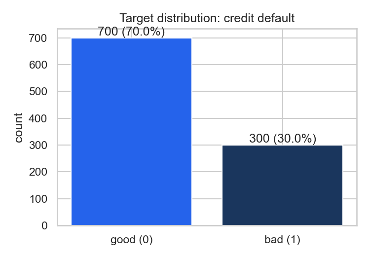

# EDA 摘要（credit-g）

- 样本量：1000 行 × 20 特征；违约率 30.0%（300/1000）
- 缺失值总数：0（credit-g 无缺失，WOE 编码器仍保留缺失处理路径）
- 数值特征最大|相关系数|：0.62（duration vs credit_amount），共线性风险低

## 图表

## 观察

- 类不平衡约 1:2.3，采用样本加权与 SMOTE 两种策略对比；
- checking_status=<0、credit_history、savings_status 等类别特征的违约率差异显著，是 WOE/IV 的强信号候选；
- 数值特征 duration 与 credit_amount 正相关但|r|<0.7，无需降维处理。