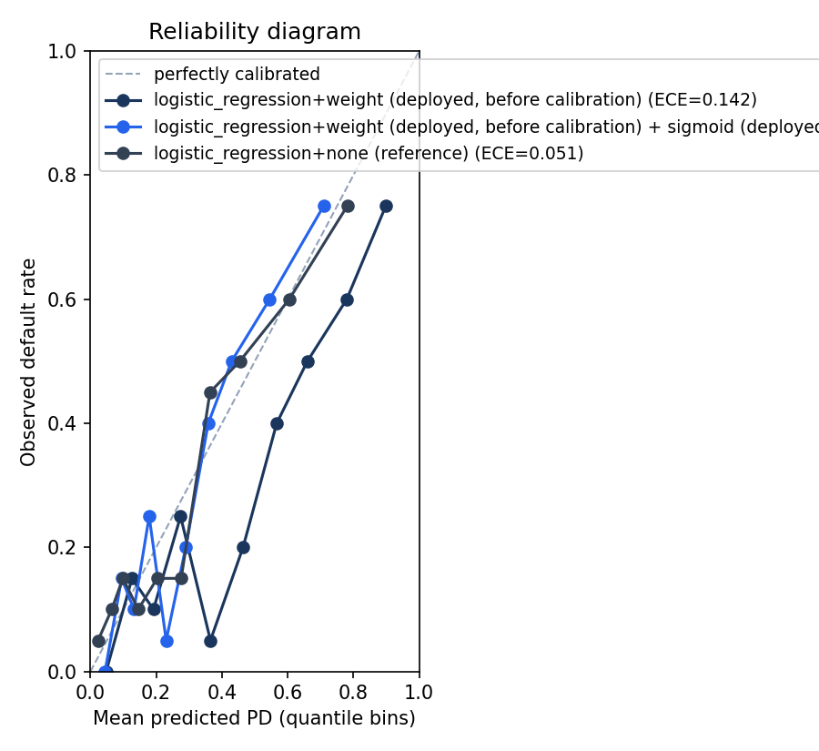
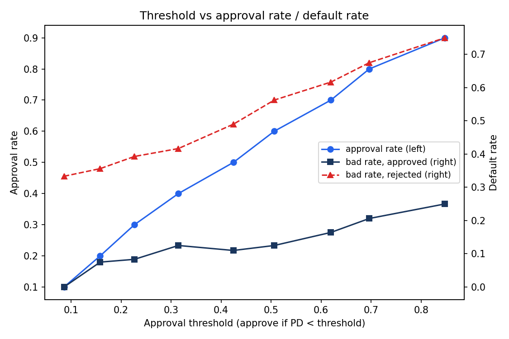

# 训练报告（credit-g 端到端）

- 训练时间：2026-10-03 00:54:23；数据：openml:credit-g:v1
- 切分：分层 train/test = 800/200（seed=42）

## 实验矩阵（2 模型 × 3 不平衡策略，5 折分层 CV + 独立测试集）

| model               | strategy   |   cv_auc_mean |   cv_auc_std |   cv_ks_mean |   cv_ks_std |   test_auc |   test_ks |   test_gini |
|:--------------------|:-----------|--------------:|-------------:|-------------:|------------:|-----------:|----------:|------------:|
| logistic_regression | weight     |      0.783594 |    0.0474992 |     0.493452 |   0.0641754 |   0.80131  |  0.511905 |    0.602619 |
| logistic_regression | smote      |      0.782366 |    0.0470072 |     0.497619 |   0.058485  |   0.800357 |  0.514286 |    0.600714 |
| logistic_regression | none       |      0.782329 |    0.0484502 |     0.499405 |   0.0679041 |   0.800357 |  0.52381  |    0.600714 |
| lightgbm            | none       |      0.746838 |    0.0446252 |     0.419643 |   0.0448211 |   0.771071 |  0.428571 |    0.542143 |
| lightgbm            | weight     |      0.746205 |    0.0450905 |     0.406548 |   0.0538222 |   0.7775   |  0.47381  |    0.555    |
| lightgbm            | smote      |      0.745275 |    0.0521509 |     0.411905 |   0.0606909 |   0.761667 |  0.445238 |    0.523333 |

**最优组合：logistic_regression + weight**；测试集 AUC=0.8013，KS=0.5119，Gini=0.6026。

## 不平衡处理结论

- **logistic_regression**：none=0.7823，weight=0.7836，smote=0.7824（CV AUC）。最优策略为 weight；weight 与 smote 差距 0.0012。两者几乎无差异——credit-g 不平衡程度温和（约 30% 坏样本），样本加权以更低复杂度达到同等效果，作为部署默认策略。
- **lightgbm**：none=0.7468，weight=0.7462，smote=0.7453（CV AUC）。最优策略为 none；weight 与 smote 差距 0.0009。两者几乎无差异——credit-g 不平衡程度温和（约 30% 坏样本），样本加权以更低复杂度达到同等效果，作为部署默认策略。

## IV 前 8（训练集 WOE/IV）

| feature            |        iv | strength   |
|:-------------------|----------:|:-----------|
| checking_status    | 0.609259  | suspicious |
| duration           | 0.293099  | medium     |
| credit_history     | 0.262438  | medium     |
| savings_status     | 0.214128  | medium     |
| purpose            | 0.149895  | medium     |
| property_magnitude | 0.145175  | medium     |
| employment         | 0.124165  | medium     |
| age                | 0.0933185 | weak       |

## 全局重要性前 8（方法：shap_mean_abs(lightgbm+weight)）

| feature            |   importance | method        |
|:-------------------|-------------:|:--------------|
| checking_status    |     1.30012  | shap_mean_abs |
| duration           |     0.70543  | shap_mean_abs |
| purpose            |     0.59907  | shap_mean_abs |
| credit_history     |     0.558987 | shap_mean_abs |
| credit_amount      |     0.448222 | shap_mean_abs |
| savings_status     |     0.418405 | shap_mean_abs |
| employment         |     0.405573 | shap_mean_abs |
| property_magnitude |     0.368578 | shap_mean_abs |

## 单样本解释示例（测试集第 1 条）

部署模型（logistic_regression）归因方法：`coef_x_woe_deviation`

```json
{
  "pd": 0.5867274320166187,
  "y_true": 0,
  "top_features": [
    {
      "feature": "savings_status",
      "contribution": -0.7680819790991104
    },
    {
      "feature": "other_payment_plans",
      "contribution": 0.5914027363347406
    },
    {
      "feature": "employment",
      "contribution": 0.44351769325132495
    }
  ]
}
```

LightGBM 的 SHAP 归因（供对照）：`[{"feature": "savings_status", "contribution": -1.9694648339386402}, {"feature": "other_payment_plans", "contribution": 1.0802475093798092}, {"feature": "credit_amount", "contribution": 0.8605682338506699}]`

## 风险分档阈值（测试集 PD 分位）

- 低风险：PD < 0.506；中风险：0.506 ≤ PD < 0.792；高风险：PD ≥ 0.792

## 概率校准（独立测试集，等频 10 桶）

排序指标（AUC/KS）不约束 PD 的绝对值；下面逐桶对比平均预测 PD 与实际违约率，
对角线代表完美校准。ECE = 按桶样本量加权的 |平均预测 PD − 实际违约率| 之和。

### 部署模型（logistic_regression+weight (deployed)）

| bin            |   n |   mean_predicted_pd |   observed_bad_rate |
|:---------------|----:|--------------------:|--------------------:|
| [0.010, 0.086) |  20 |           0.0477177 |                0    |
| [0.086, 0.158) |  20 |           0.126334  |                0.15 |
| [0.158, 0.227) |  20 |           0.191625  |                0.1  |
| [0.227, 0.315) |  20 |           0.274096  |                0.25 |
| [0.315, 0.425) |  20 |           0.364974  |                0.05 |
| [0.425, 0.506) |  20 |           0.464094  |                0.2  |
| [0.506, 0.620) |  20 |           0.566534  |                0.4  |
| [0.620, 0.696) |  20 |           0.659857  |                0.5  |
| [0.696, 0.848) |  20 |           0.779696  |                0.6  |
| [0.848, 0.968) |  20 |           0.898098  |                0.75 |

Brier=0.1810，ECE=0.1420，平均预测 PD=0.437，实际违约率=0.300

### 参照（logistic_regression+none (reference)）

| bin            |   n |   mean_predicted_pd |   observed_bad_rate |
|:---------------|----:|--------------------:|--------------------:|
| [0.005, 0.042) |  20 |           0.0232149 |                0.05 |
| [0.042, 0.080) |  20 |           0.0645742 |                0.1  |
| [0.080, 0.116) |  20 |           0.0988052 |                0.15 |
| [0.116, 0.170) |  20 |           0.14526   |                0.1  |
| [0.170, 0.234) |  20 |           0.202851  |                0.15 |
| [0.234, 0.312) |  20 |           0.275873  |                0.15 |
| [0.312, 0.408) |  20 |           0.363579  |                0.45 |
| [0.408, 0.496) |  20 |           0.454297  |                0.5  |
| [0.496, 0.692) |  20 |           0.604811  |                0.6  |
| [0.692, 0.919) |  20 |           0.781021  |                0.75 |

Brier=0.1574，ECE=0.0505，平均预测 PD=0.301

**结论**：部署模型平均预测 PD 0.437 vs 实际违约率 0.300（偏移 +0.137）→ PD 绝对值系统性偏高；参照（未加权 LR）平均预测 PD 0.301，ECE 0.0505 vs 部署模型 0.1420。balanced 加权改善排序（AUC/KS）但把 PD 绝对值抬高，PD 不能直接当作真实违约概率用于定价或资本计算；风险分档阈值基于 PD 相对排序，不受此偏移影响。如需绝对校准可在验证集上做 Platt/isotonic 修正（本项目未实现）。



## 阈值-业务指标（批准率 / 坏账率，独立测试集）

决策规则：PD < 阈值 → 批准，PD ≥ 阈值 → 拒绝（n=200）。
阈值取测试集 PD 的十分位分位数，属排序型阈值，不受 PD 绝对值校准偏移影响。

### 阈值扫描（PD 十分位）

|   threshold |   n_approved |   approval_rate |   bad_rate_approved |   n_rejected |   bad_rate_rejected |
|------------:|-------------:|----------------:|--------------------:|-------------:|--------------------:|
|   0.0858268 |           20 |             0.1 |           0         |          180 |            0.333333 |
|   0.158145  |           40 |             0.2 |           0.075     |          160 |            0.35625  |
|   0.226655  |           60 |             0.3 |           0.0833333 |          140 |            0.392857 |
|   0.314592  |           80 |             0.4 |           0.125     |          120 |            0.416667 |
|   0.424644  |          100 |             0.5 |           0.11      |          100 |            0.49     |
|   0.50632   |          120 |             0.6 |           0.125     |           80 |            0.5625   |
|   0.619642  |          140 |             0.7 |           0.164286  |           60 |            0.616667 |
|   0.696472  |          160 |             0.8 |           0.20625   |           40 |            0.675    |
|   0.847835  |          180 |             0.9 |           0.25      |           20 |            0.75     |

### 按目标批准率反查阈值

|   target_approval_rate |   threshold |   n_approved |   approval_rate |   bad_rate_approved |   n_rejected |   bad_rate_rejected |
|-----------------------:|------------:|-------------:|----------------:|--------------------:|-------------:|--------------------:|
|                    0.7 |    0.619642 |          140 |             0.7 |            0.164286 |           60 |            0.616667 |
|                    0.8 |    0.696472 |          160 |             0.8 |            0.20625  |           40 |            0.675    |
|                    0.9 |    0.847835 |          180 |             0.9 |            0.25     |           20 |            0.75     |

**结论**：批准率从 90% 收紧到 70%（阈值 0.848 → 0.620），批内坏账率由 25.0% 降至 16.4%（相对下降 34%），被拒人群坏账率 61.7%。本分析为描述性扫描，未引入利润/损失矩阵做阈值最优化；测试集仅 200 条，最细分组（十分位扫描每档、或最松目标下的拒绝组）约 20 条，坏账率读数对单样本波动敏感（±1 个坏样本 ≈ ±5 个百分点）。


